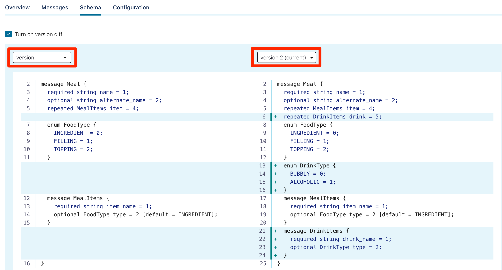

Experiments with Kafka serialization schemes

# Kafka with AVRO vs., Kafka with Protobuf vs., Kafka with JSON Schema  

Apache Avro was has been the defacto Kafka serialization mechanism for a long time.   Confluent just updated their Kafka streaming platform with additioinal support for serializing data with Protocol buffers (or _protobuf_) and JSON Schema serialization.  

Although most of Apache Kafka users use Apache Avro to define contracts for their messages, it's always been a bit of a "Java thing".  Classes automatically generated by the Apache Avro compiler favor JVM developers. You can certainly use AVRO in pretty much any language, however, Google Protocol Buffer (protobuf) is very popular for serializing, deserializing and validating data in other languages (Python, Rust, Ruby, Go).

The inclusion of Protobuf and JSON Schema applies at producer and consumer libraries, schema registry, Kafka connect, ksqlDB along with Control Center.


## Do I care about serializing structured data?

Why bother with serializing structured data?  Let's start with an example data string ... `cookie,50,null`.  What does this data mean? Is _cookie_ a name, a place or something to eat?  And what about _50_ - is this an age, a temperature or something else?

If you were using a database (such as Postgres or Oracle) to store your data you would create a table definition (with nicely named columns and appropriate data types). The same is true for your streaming platform - you really should pick data format for serializing structured data. Bonus points for and being consistent across your data platform!

Until recently your choices for serializing structured data within Kafka were limited. You had "bad" choices (such as free text or CSV) or the "right" choice of using Apache Avro. Avro is an open source data serialization system which marshals your data (and it's appropriate schema) to a efficient binary format.  One of the core features of Avro is the ability to define a schema for our data. So our data `cookie,50,null` would be associated with a _snack_ Avro schema like this

```
{
  "type": "record",
  "name": "snacks",
  "fields": [
      {"name": "name",  "type": "string" }
    , {"name": "calories", "type": "float" }
    , {"name": "colour", "type": "string", "default": null}
  ]
}
```

Here we can see our data `cookie,50,null` is snack data (the most important type of data). We can see _cookie_ is a _string_ representing the name of the snake. Our schema offers us a lot of flexibility (our schema can evolve over time) plus ensures data integrity (for example, ensuring calories are integers ).  

# AVRO, Protobuf, JSON Schema use with Kafka

This _isn't_ a blog on the "best" serialization strategy. However, let's get familiar with how we can use new choices for serializing structured data

Our initial set of yummy data looks like this

```
{"name": "cookie", "calories": 500, "colour": "brown"}
{"name": "cake", "calories": 260, "colour": "white"}
{"name": "timtam", "calories": 80, "colour": "chocolate"}
```

## AVRO serialization 
Let's remind ourselves how to encode our snacks using AVRO serialization. We'll use the include command line tool `kafka-avro-console-producer` as a Kafka producer which can perform serialization (with a schema provided as a command line parameter).  A _producer_ is something that _writes_ data into a Kafka broker.

```
kafka-avro-console-producer  --broker-list localhost:9092 --topic SNACKS_AVRO --property value.schema='
{
  "type": "record",
  "name": "myrecord",
  "fields": [
      {"name": "name",  "type": "string" }
    , {"name": "calories", "type": "float" }
    , {"name": "colour", "type": "string" }
  ]
}' < snacks.txt
```

And to _read_ the data, we can use the `kafka-avro-console-consumer` command line application to act as kafka consumer to read and de-serializing our AVRO data

```
kafka-avro-console-consumer --bootstrap-server localhost:9092 --topic SNACKS_AVRO --from-beginning 

{"name":"cookie","calories":500.0,"colour":"brown"}
{"name":"cake","calories":260.0,"colour":"white"}
{"name":"timtam","calories":80.0,"colour":"chocolate"}
```

## Protocol Buffers (Protobuf) serialization 

This time we'll use _protobuf_ serialization with the new `kafka-protobuf-console-producer` kafka producer. The concept is similar to to approach we took with AVRO, however this time our Kafka producer will can perform protobuf serialization.  Note the protobuf schema is provided as a command line parameter.

```
kafka-protobuf-console-producer --broker-list localhost:9092 --topic SNACKS_PROTO --property value.schema='
message Snack {
    required string name = 1;
    required int64 calories = 2;
    optional string colour = 3;
}' < snacks.txt
```

And to read the data, we can use the `kafka-protobuf-console-consumer` kafka consumer for de-serializing our protobuf data

```
kafka-protobuf-console-consumer --bootstrap-server localhost:9092 --topic SNACKS_PROTO --from-beginning 

{"name":"cookie","calories":"500","colour":"brown"}
{"name":"cake","calories":"260","colour":"white"}
{"name":"timtam","calories":"80","colour":"chocolate"}
```


## JSON Schema serialization 

Finally we'll use JSON Schema serialization with the new `kafka-json-schema-console-producer` kafka producer.  Note the json-schema schema is provided as a command line parameter.

```
kafka-json-schema-console-producer --broker-list localhost:9092 --topic SNACKS_JSONSCHEMA --property value.schema='
{
  "definitions" : {
    "record:myrecord" : {
      "type" : "object",
      "required" : [ "name", "calories" ],
      "additionalProperties" : false,
      "properties" : {
        "name" : {"type" : "string"},
        "calories" : {"type" : "number"},
        "colour" : {"type" : "string"}
      }
    }
  },
  "$ref" : "#/definitions/record:myrecord"
}' < snacks.txt
```

And to read the data, we can use the `kafka-json-schema-console-consumer` kafka consumer for de-serializing our json-schema data

```
kafka-json-schema-console-consumer --bootstrap-server localhost:9092 --topic SNACKS_JSONSCHEMA --from-beginning 

{"name":"cookie","calories":"500","colour":"brown"}
{"name":"cake","calories":"260","colour":"white"}
{"name":"timtam","calories":"80","colour":"chocolate"}
```

# Protobuf with the Confluent Schema Registry

You may have wondered where the schemas actually went in the above examples?  The Confluent Schema Registry has been diligently storing these schemas (as part of the serialization process when using kafka-blah-console-producer).  That is, both the schema name (eg., _SNACKS_PROTO-value_), schema content, version and style (protobuf, Avro) have all been stored.  We can peak at the stored schema with `curl`. For example, to explore the recently used protobuf schema for our snacks

```
curl -s -X GET http://localhost:8081/subjects/SNACKS_PROTO-value/versions/1 
```

Which responds the this snack schema (yummy)

```
{
  "subject": "SNACKS_PROTO-value",
  "version": 1,
  "id": 6,
  "schemaType": "PROTOBUF",
  "schema": "\nmessage Snack {\n  required string name = 1;\n  required int64 calories = 2;\n  required string colour = 3;\n}\n"
}
```


# What you can do with Protobuf and can't do with Avro?

Let's have a look at a more complex modeling example to illustrate some of the possibilities with Protobuf schemas.  Imagine we want to model a meal and describe the ingredients within the meal. We can use a protobuf schema to describe a meal such as a _taco_ is composed of _beef filling_ and _cheese topping_.

Our data for a taco and fish-and-chips meal could look like this

```
{
  "name": "tacos",
  "item": [
    {
      "item_name": "beef",
      "type": "FILLING"
    },
    {
      "item_name": "cheese",
      "type": "TOPPING"
    }
  ]
}, {
  "name": "fish and chips",
  "alternate_name": "fish-n chips",
  "item": []
}
```

An example protobuf schema to represent our meals would look like this

```
message Meal {
  required string name = 1;
  optional string alternate_name = 2;

  enum FoodType {
    INGREDIENT = 0;
    FILLING = 1;
    TOPPING = 2;
  }

  message MealItems {
    required string item_name = 1;
    optional FoodType type = 2 [default = INGREDIENT];
  }

  repeated MealItems item = 4;
}
```


To try this modeling with protobuf in Kafka


```
kafka-protobuf-console-producer --broker-list localhost:9092 --topic MEALS_PROTO --property value.schema='
message Meal {
  required string name = 1;
  optional string alternate_name = 2;

  enum FoodType {
    INGREDIENT = 0;
    FILLING = 1;
    TOPPING = 2;
  }

  message MealItems {
    required string item_name = 1;
    optional FoodType type = 2 [default = INGREDIENT];
  }

  repeated MealItems item = 4;
}' < meals.txt
```

Which gives you an idea of how flexible data represntation can be using protobuf in Kafka.  But what happens if we need to make changes to these schemas?


# Schema Evolution with Protobuf 
As the saying goes - _the only constant is change_. Any good data platform needs to accommodate changes - such as additions or changes to a schema.  Supporting schema evolution is a fundamental requirement for a streaming platform, so our serialization mechanism also needs to support schema changes (or evolution). Protobuf and Avro both offer mechanisms for updating schema without breaking downstream consumers - which could still be using a previous schema version.

## Adding drinks to our meals

Tacos and pizza's sound great - but let's have something to drink with our meal!  We can now add some additional attributes to our schema to include meals.  This is sometimes called _schema evolution_.  Note we'll continue to use the existing `MEALS_PROTO` topic.

A new data payload (with the inclusion of _beer_)

```
{
  "name": "pizza",
  "drink": [
    {
      "drink_name": "beer",
      "type": "ALCOHOLIC"
    }
  ]
}
```

```
kafka-protobuf-console-producer --broker-list localhost:9092 --topic MEALS_PROTO --property value.schema='
message Meal {
  required string name = 1;
  optional string alternate_name = 2;

  enum FoodType {
    INGREDIENT = 0;
    FILLING = 1;
    TOPPING = 2;
  }

  enum DrinkType {
    BUBBLY = 0;
    ALCOHOLIC = 1;
  }

  message MealItems {
    required string item_name = 1;
    optional FoodType type = 2 [default = INGREDIENT];
  }

  message DrinkItems {
    required string drink_name = 1;
    optional DrinkType type = 2 ;
  }

  repeated MealItems item = 4;
  repeated DrinkItems drink = 5;
}' < meals-2.txt
```

## Visualizing schema difference with Confluent Control Center

One nice inclusion with the _Confluent Control Center_ (the Web GUI included in the Confluent platform) is the ability to look at schemas, and the _differences between schemas_.  For example, we can see version 1 and version 2 of the `MEALS_PROTO-value` schema




# Application Binding - Protobuf classes with Python
Let us now build an application demonstrating protobuf classes


To regenerate Protobuf classes you must first install the protobuf compiler.  See the protocol buffer docs for instructions on installing and using protoc.
https://developers.google.com/protocol-buffers/docs/pythontutorial


### Setup Python virtual environment 

```
virtualenv myenv
. ./myenv/bin/activate
pip install -r requirements.txt
```

### Python compile schema
```
protoc -I=. --python_out=. ./user.proto
```


## Other Profotbuf tips with protoc

To encode
```
protoc --encode="Foo" ./my.proto < mydata.txt  > mydata.prot
```

To decode
```
protoc --decode="Foo" ./my.proto < mydata.prot
```


```
kafka-protobuf-console-producer --broker-list localhost:9092 --topic mytopic1 --property value.schema='
message Foo { required string f1 = 1; }'
```


# References

- https://www.confluent.io/blog/confluent-platform-now-supports-protobuf-json-schema-custom-formats/
- https://blog.softwaremill.com/the-best-serialization-strategy-for-event-sourcing-9321c299632b


